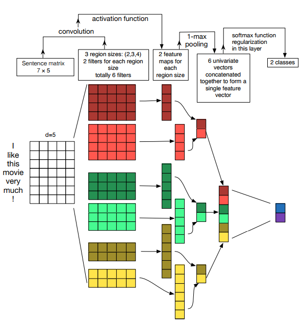

# CNN Zhang for Sentiment Analysis

Implementation of [A Sensitivity Analysis of (and Practitioners’ Guide to) Convolutional Neural Networks for Sentence Classification](https://arxiv.org/pdf/1510.03820.pdf) in Tensorflow 2.0.

Toy example using IMDB dataset with tf.data

